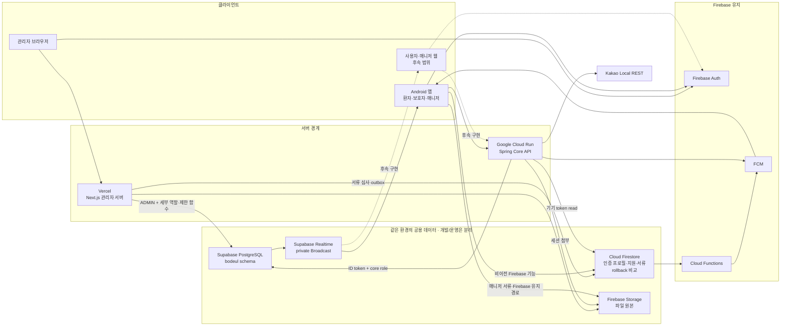

# 현재 인프라 구성도

기준일: 2026-09-27

초기에는 빠른 구현을 우선했기 때문에 모든 선택 근거가 사전에 정리되지는 않았다.
현재는 구현된 구조를 기준으로 선택 이유, 대안, 단점, 전환 조건을 정리하고 있다.

## 한 줄 결론

개발과 운영은 각각 `Vercel Next.js 관리자 서버 + Cloud Run Spring Core API + 공용 Supabase PostgreSQL + Supabase Realtime + Firebase Auth/FCM/App Check/Storage`로 구성한다. 두 서버는 같은 환경의 DB만 공유하고 개발·운영의 DB·인증·자격 증명은 분리한다. 양쪽 DB V23, 운영 Core 배포·관리자 DB 연결과 최초 MFA 로그인까지 확인했으며 주요 업무·교차 환경 토큰·App Check 강제 등 출시 검증은 남아 있다.

## 구성도

## 현재 구현 상태

| 경계 | 현재 상태 | 검증 |
| --- | --- | --- |
| 관리자 웹 | 별도 `bodeul-admin-web` 저장소, Next.js, Vercel | 9월 27일 Production 배포, 최초 개인 SUPER_ADMIN·TOTP와 MFA 후 대시보드 진입 확인. 주요 업무 전체 검증은 별개 |
| 관리자 DB 접속 | `bodeul_admin_service`, transaction pooler, 최대 연결 5 | 개발 검증과 9월 27일 운영 TLS 로그인·조회·직접 쓰기 차단 확인. 상세는 [환경 기준](../operations/admin-web-environments.md) 참조 |
| 사용자 Core API | `core-api/`, Java 21, Spring Boot, Cloud Run Tokyo | 9월 27일 개발·운영 배포, health 200·무인증 401 확인. 운영 정상 사용자·Kakao 업무 검증은 남음 |
| Kakao Local | Core API의 `/api/places/search` 뒤에 배치 | Android 직접 REST 키 제거, 인증된 실제 호출 확인 |
| 공용 DB | Supabase Pro, 개발·운영 PostgreSQL을 Tokyo에 분리 | 양쪽 V23·실패 0, 운영 V23 logical backup·격리 복원·외부 보관 확인 |
| 실시간 | Supabase Realtime private Broadcast | 개발의 실제 구독 검증 기록과 양쪽 환경의 SQL 인가 검사를 구분. 운영 정상 서명 token·실소켓 확인은 남음 |
| Firebase | 개발·production Auth, Firestore, Storage를 분리 | production Rules 배포, Firestore 삭제 방지, App Check는 미강제 |

## 저장소 소유권

| 저장소 | 소유 범위 |
| --- | --- |
| `bodeul110/bodeul-platform` | Android, Spring Core API, DB migration, Firebase Rules·Functions, 공용 계약과 운영 문서 |
| `bodeul110/bodeul-admin-web` | Next.js 관리자 UI·서버, Vercel 배포, Vite rollback, 관리자 전용 문서와 CI |

기존 메인 저장소의 `api/` Node 프로토타입과 `admin-web/` 중복본은 대체 계약의 실제 검증 후 제거했다. 종료 근거는 [Issue 159 기록](../reports/issue-159-node-api-retirement-audit-2026-07-16.md)에 남긴다.

## 데이터 source of truth

| 도메인 | 현재 기준 | 전환 원칙 |
| --- | --- | --- |
| 인증 | Firebase Auth | 유지하고 두 서버가 ID token을 검증한다. |
| 예약·세션·결제·채팅·읽음·리포트·후속 처리 | 개발 PostgreSQL | Android는 Core API, 관리자 배정·결제는 Next.js의 제한 함수. Realtime 이벤트 뒤 API snapshot 재조회 |
| 위치 | legacy PostgreSQL 계약은 기본 OFF | 환자 GPS 1분 공유는 목표이며 기존 매니저 위치 경로와 별도 구현·검증이 필요함 |
| 인증 프로필·지원·매니저 서류 | Firestore | Firebase 결합 기능으로 유지하며 PostgreSQL 업무 원본과 섞어 쓰지 않는다. |
| 기존 예약·세션 문서 | Firestore rollback 비교 자료 | client 업무 쓰기를 차단하고 전환 결과 비교와 제한적 조회에만 사용한다. |
| 병원 가이드 관리자 조회 | PostgreSQL | Next.js 관리자 서버를 통해 읽는다. |
| 예약 요청 read model | 개발 PostgreSQL | Android와 관리자 웹은 각 서버 API를 통해 같은 PostgreSQL 상태를 읽는다. 기존 Firestore 문서는 rollback 비교 자료다. |
| Core 업무 role·관계형 운영 데이터 | PostgreSQL | 서버별 최소 권한 role을 사용한다. Firebase 유지 기능의 role은 Firestore·Storage Rules가 판정한다. |
| 세션 첨부 원본 | Firebase Storage | Android는 Core API를 거치고 경로·해시·크기·만료 상태는 PostgreSQL에서 인가한다. |
| 매니저 서류 원본 | Firebase Storage | 앱 업로드와 관리자 미리보기 경계를 유지하고 심사 메타데이터는 Firestore를 사용한다. |
| 푸시 | Core API + FCM, Firebase 기능은 Functions + FCM | 채팅·위치는 Core commit 결과로 보내고 예약·지원 등 Firebase 결합 알림은 Functions가 처리한다. |
| 실시간 화면 갱신 | Supabase Realtime private Broadcast | PostgreSQL 커밋 뒤 변경 신호만 보내고 재연결 시 Core API snapshot을 다시 조회한다. |

## 남은 운영 전환

- 배포된 두 운영 서버에서 정상 인증·역할별 업무·감사와 교차 환경 거부를 검증한다. 최초 관리자 로그인과 나머지 업무의 차이는 [관리자 웹 환경 기준](../operations/admin-web-environments.md)을 따른다.
- 기본 Vercel 운영 도메인과 등록된 Auth domain을 유지하고, custom domain이 필요해질 때 별도 변경한다. App Check 강제와 출시 승인은 후속 게이트다.
- 개발에서 전환한 예약·매칭·동행·채팅·위치 domain을 production 데이터 cutover와 함께 재검증한다.
- Cloud Run과 Vercel의 운영 rollback 리허설을 검증한다. PostgreSQL V23 격리 복원은 9월 27일 완료했으며 운영 DB에 복원하지 않았다.
- 실제 운영 전에 플랜·비용·백업 조건을 확인하고 Go/No-Go를 수행한다. 이전 문서의 11월·12월 일정은 계획용 가정이며 확정 운영일이 아니다.

이 항목은 구현 미완료와 운영 의사결정을 구분한다. 현재 개발 경계의 인증·인가·DB 연결과 production 복원은 검증됐지만 production 트래픽 전환 완료를 뜻하지 않는다.

## 관련 문서

- [목표 인프라 구조](target-infrastructure.md)
- [시스템 아키텍처 다이어그램](system-architecture-diagram.md)
- [PostgreSQL API 경계](postgres-api-boundary.md)
- [Spring Core API 인프라 런북](../operations/core-api-infrastructure-runbook.md)
- [관리자 웹 저장소 분리 기록](../operations/admin-web-repository-split.md)
