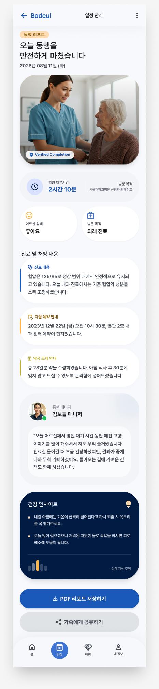

# 보호자 최종 리포트 Figma 구현 결정

## 목적

- Figma 파일 `NX07k3Tu4cLc6YgAV82RXp`, 노드 `8:1464`의 보호자 최종 리포트를 `GuardianReportActivity`의 실제 읽기 화면에 적용한다.
- 기존 인증, 보호자 권한, 리포트 저장소, 빈 상태, 오류, 재시도, 요청 상세 이동 흐름은 유지한다.

## 선택한 접근

- 완료된 예약이면서 서버 `SessionReport`에 표시 가능한 섹션이 하나 이상 있을 때만 Figma형 최종 리포트를 렌더링한다.
- 병원명, 진료과, 환자 상태, 완료 시각, 진료·처방 내용, 매니저 전달 사항은 기존 도메인 모델의 실제 값만 사용한다. 완료 일지가 없으면 생성된 문구 대신 실제 `guardianUpdate`를 `최근 현장 업데이트`로 명시해 보여준다.
- 리포트가 없거나 아직 완료되지 않은 항목은 기존 진행 상태·현장 메모·리포트 대기 화면을 유지한다.
- Figma의 이미지 자산은 장식용 히어로로만 사용하며 화면에 `화면 연출 이미지`를 명시해 실제 환자 사진이나 현장 증빙으로 오인되지 않게 한다.
- 기준 화면은 `docs/design/assets/figma-node-8-1464.png`, 실제 적용 히어로 자산은 `figma_guardian_report_image_1.png`로 보관한다. Figma의 실사 매니저 아바타는 서버 프로필 사진처럼 오인될 수 있어 공통 프로필 아이콘으로 대체한다.
- 기존 공통 하단 내비게이션을 재사용하고 일정 탭을 선택 상태로 연결한다.
- `ServiceLocator` 접근은 `provideAuthRepository()`와 `provideGuardianReportRepository()` 보호 훅으로 감싸 운영 기본 동작을 유지하면서 debug 미리보기에서 로컬 저장소를 주입할 수 있게 한다.
- Android edge-to-edge 환경에서는 전용 insets 바인더로 상단 앱바, 스크롤 여백, 하단 내비게이션을 시스템 바 안쪽에 배치한다.
- 인증·대시보드 요청마다 세대 번호를 부여하고 `onStop()`에서 무효화해 이전 계정의 늦은 콜백이 리포트를 다시 노출하지 못하게 한다.

## 상태 매핑

| 저장소/화면 상태 | 표시 |
| --- | --- |
| 인증 또는 대시보드 조회 중 | 기존 콘텐츠를 숨기고 중앙 로딩 표시 |
| 보호자 권한 없음 또는 인증 실패 | 기존 차단 상태 패널 |
| 조회 오류 | 오류 본문과 실제 `refreshDashboard()` 재시도 |
| 연결된 요청 없음 | 기존 빈 상태 패널 |
| 진행 중이거나 리포트 섹션 없음 | 기존 진행·현장 메모·리포트 대기 카드 |
| 완료 상태이고 실제 리포트 섹션 존재 | Figma형 최종 리포트 읽기 카드 |

## 제외한 항목과 이유

- Figma의 병원 체류 시간은 현재 도메인에 시작 시각 계약이 없어서 표시하지 않았다.
- 어르신 상태의 평가 등급은 별도 서버 필드가 없어 생성하지 않고, 요청에 실제 `patientConditionSummary`가 있을 때만 노출한다.
- 건강 인사이트, 날씨 기반 문구, 추세 차트는 서버 또는 분석 모델 계약이 없어 생성하지 않았다.
- PDF 저장과 가족 공유 버튼은 산출물 URL·공유 권한·파일 생성 계약이 없어 동작하지 않는 버튼을 만들지 않았다. 기존 요청 상세 이동만 유지한다.

## 대안

- Figma 예시 문구를 고정 문자열로 채우는 방법은 시각적으로 가장 가깝지만 실제 환자 데이터처럼 오인될 수 있어 제외했다.
- 완료 리포트 전용 Activity를 새로 만드는 방법은 화면 경로를 분리할 수 있지만 현재 저장소가 다건 대시보드를 반환하므로 기존 상태와 내비게이션 흐름을 중복하게 되어 제외했다.

## 위험과 완화

- 오래된 완료 데이터에 `careEndedAtMillis`가 없을 수 있다. 이때는 현재 `yyyy-MM-dd HH:mm` 예약 계약만 화면 날짜로 변환하고, 다른 서버 포맷은 원문을 그대로 표시한다.
- 빈 `SessionReport` 객체가 내려올 수 있다. 실제 섹션이 비어 있으면 완료 리포트로 전환하지 않고 대기 상태를 표시한다.
- 화면에 여러 항목이 있으면 완료 리포트 카드가 연속으로 나타날 수 있다. 데이터 손실 없이 현재 다건 계약을 유지하는 쪽을 우선했고, 향후 API가 단건 리포트 상세 계약을 제공하면 전용 화면으로 분리할 수 있다.
