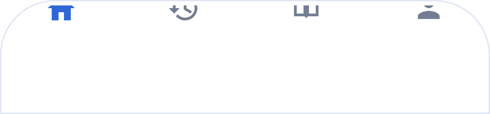
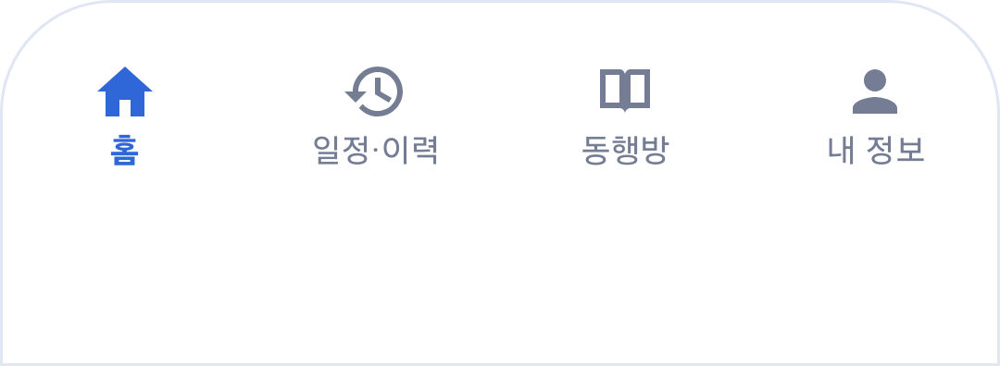

# 하단 내비게이션 잘림 점검

기준: 2026-09-27 `dev`의 `499069e`. 관련 이슈는 [#448](https://github.com/bodeul110/bodeul-platform/issues/448)이다.

## 구현한 내용

채팅과 내 정보는 공통 `BottomNavigationView`를 84dp 높이로 표시하지만 시스템 하단 여백만 늘어나고 전체 높이는 그대로였다. 48dp 하단 inset을 주입하면 탭 콘텐츠가 위쪽으로 잘리고 라벨이 사라지는 것을 재현했다. Notion 원본 캡처의 빌드와 이동 경로는 알려지지 않았으므로, 그 캡처와 동일한 원인이라고 단정하지 않는다.

공통 `ClientBottomNavigationBinder`에 안전영역 처리를 연결했다. 고정 높이와 하단 padding에 같은 inset을 더하고, 재연결·inset 재전달 때 누적하지 않는다. IME 높이를 메뉴 자체에 더하지 않으며 `wrap_content`는 유지한다. 이미 보정하던 화면도 같은 헬퍼를 사용한다. 채팅·내 정보의 스크롤 끝에는 시스템·IME 여백을 적용해 높아진 메뉴가 마지막 항목을 덮지 않도록 했다.

## 변경된 범위

- 홈, 예약 폼, 예약 내역, 동행방, 내 정보, 보호자 리포트의 공통 하단 탭.
- 기존 화면별 상단 바, 4개 탭의 이동 대상과 역할별 표시 조건은 변경하지 않았다. 스크롤 보정이 없던 채팅·내 정보만 시스템·IME 여백을 추가했다.
- 매니저 전용 메뉴, 서버·DB·인증·예약 생성 계약, 관리자 웹과 의존성 버전은 변경하지 않았다. 매니저의 공통 채팅 화면에도 스크롤 여백은 적용하지만 환자용 탭을 표시하지 않는다.

## 검증

기기: Galaxy S24 / Android 16 / 1080×2340, 실제 글자 배율 1.0. 기기 표시·내비게이션 설정은 바꾸지 않았다. Debug Firebase 설정이 없는 Mock/CI 빌드와 로컬 미리보기 저장소를 사용했다.

| 확인 | 결과와 범위 |
| --- | --- |
| 수정 전 재현 | 신규 회귀 테스트 3건 실패. 내 정보 메뉴 경계 검사와 채팅 높이 검사에서 잘림·높이 미보정 확인 |
| 메뉴·스크롤 안전영역 | 신규 테스트 6건 통과. 6개 실제 화면 XML, 하단 0/24/48dp, 좌우 컷아웃, 반복 전달·재연결·숨김/표시 검사. 채팅·내 정보의 스크롤 끝 내용이 탭 위에 남는 것 확인 |
| 작은 화면·큰 글자 | 기기 전역 설정 대신 테스트 Context에 폭 320/360dp, 글자 배율 1.0/2.0 적용. 각 탭 선택 상태의 아이콘·라벨 경계, 말줄임, 48dp 터치 크기 통과 |
| 키보드 | 280dp IME inset을 주입해 메뉴 높이에 키보드 높이가 누적되지 않는 것 확인. 실제 IME의 전체 화면 조합 검증은 아님 |
| 예약 화면 재생성 | 실제 `BookingActivity`를 상속한 로컬 미리보기에서 기기의 실제 window inset과 전체 메뉴 높이 확인, Activity 재생성 후에도 통과 |
| 화면 회귀 | 예약·보호자 리포트·매니저 가이드·초안·파일 복구 등 기기 테스트 총 37건 통과 |
| 빌드·단위 테스트 | `assembleDebug`, `assembleDebugAndroidTest`, `testDebugUnitTest` 통과. 단위 테스트 304건, 실패·오류·건너뜀 0 |
| 환경 경계 | `verifyReleaseAppCheckClasspath`, `node tools/android/check-environment-boundary.mjs` 통과 |

### 전후 비교

같은 내 정보 화면 XML에서 폭 360dp·글자 배율 1.0·하단 inset 48dp를 적용한 메뉴만 기기에서 그린 이미지다. 실제 OS 내비게이션 아이콘이나 전체 화면을 캡처한 자료는 아니며, 합성 메뉴 외 개인정보는 포함하지 않는다.

| 수정 전 | 수정 후 |
| --- | --- |
|  |  |

### 회귀 테스트 재실행

```powershell
.\gradlew.bat assembleDebug assembleDebugAndroidTest testDebugUnitTest :app:verifyReleaseAppCheckClasspath --console=plain
adb install -r app/build/outputs/apk/debug/app-debug.apk
adb install -r app/build/outputs/apk/androidTest/debug/app-debug-androidTest.apk
adb shell am instrument -w -r -e class com.example.bodeul.ui.navigation.ClientBottomNavigationInsetsTest,com.example.bodeul.ui.booking.ClientBookingHistoryInsetsTest,com.example.bodeul.debug.BookingFigmaPreviewTest,com.example.bodeul.debug.GuardianReportFigmaPreviewTest com.example.bodeul.test/androidx.test.runner.AndroidJUnitRunner
```

위 명령은 직접 영향 범위의 10건을 실행한다. 이미지가 필요하면 instrumentation에 `-e navigationEvidence after`를 더한다. 이미지는 앱 외부 캐시의 `navigation-insets-after.png`에 생성된다.

## 남은 범위

- 합성 예약을 실제 생성한 뒤 접수 완료 → 홈 → 일정·이력 → 동행방 → 내 정보로 이동하는 전체 흐름은 아직 실행하지 않았다. 이번 미리보기는 예약을 제출하지 않는다.
- 제스처·3버튼에 해당하는 inset 차이는 자동 검증했지만 기기 OS 설정을 실제로 전환하지 않았다. 실제 키보드 표시·숨김과 위 전체 이동 경로도 후속 검증에 남긴다.
- 권한별 서버 조회, 보호자 동의와 운영 데이터는 검증·변경하지 않았다. #448은 이 수정의 리뷰와 남은 화면 전환 검증 전까지 종료하지 않는다.
